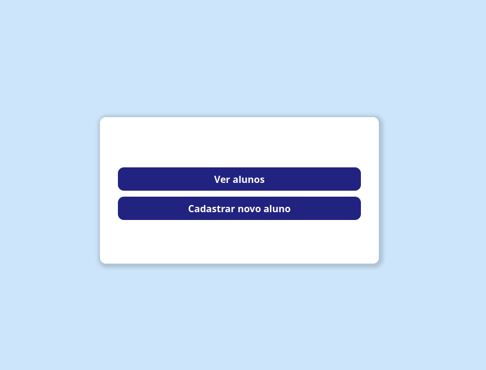
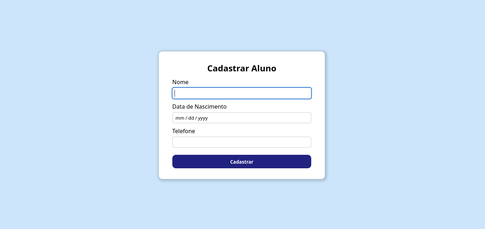
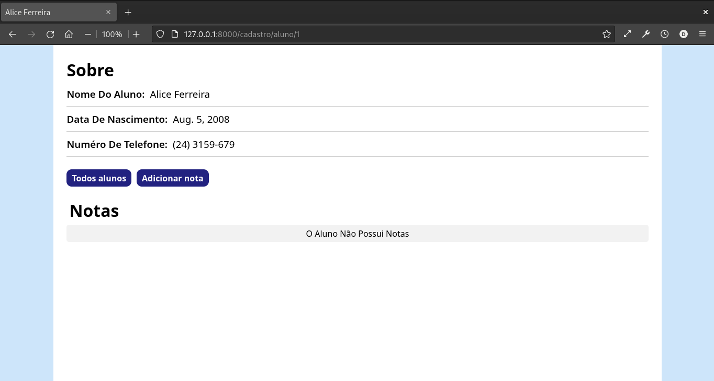
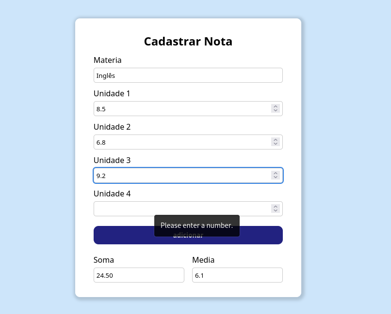
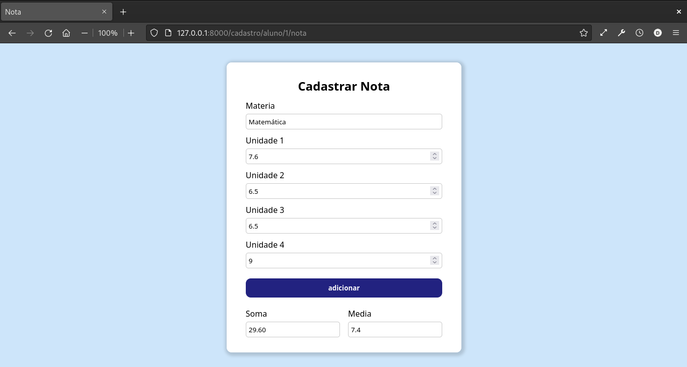
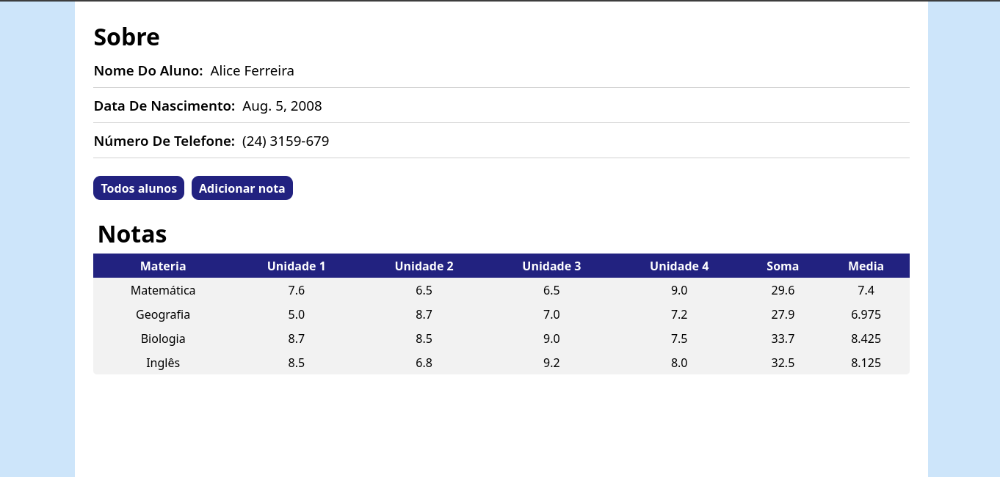
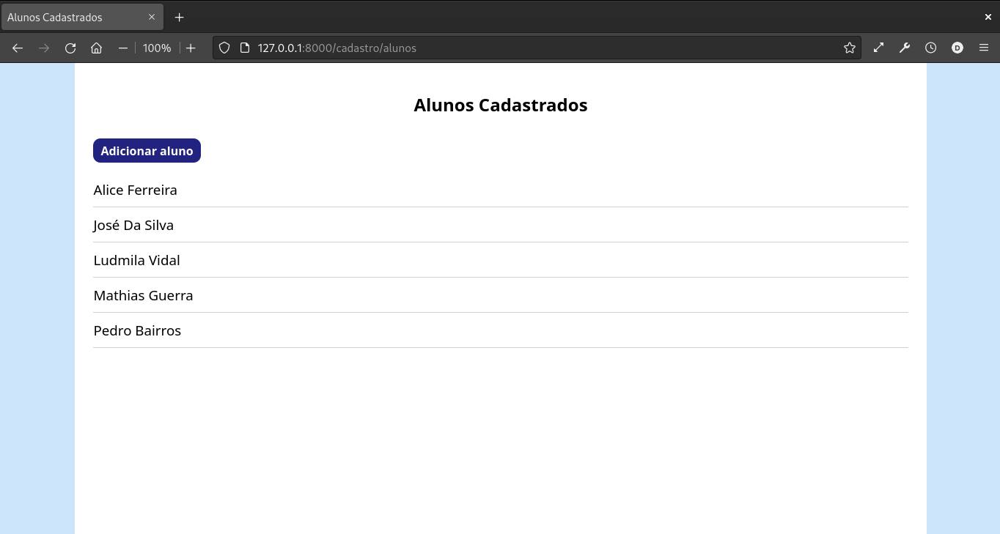

# Cadastro de Notas

Permite cadastrar alunos e suas respectivas notas.

## Feito com:
- Django
- Postgresql
- Javascript
- CSS + HTML

### Cadastrar alunos

### Sobre do aluno

### Cadastro de notas

### Display de notas

### Alunos cadastrados

